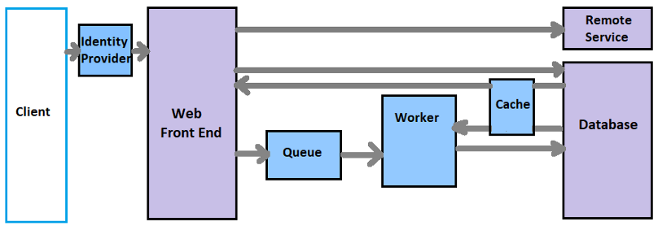

# Kane's OnBoarding Project
## Exercise 01:
- Result: Finished exercise 1.
- Time Consumed: 1 day
- My learning after this exercise: It was too hard to set up the environment. I have struggled too much. I think it is kick-starting for me to have more projects with AI models.  

#### How to run Ex01's code: 
- Step1: Download lib-layout's model and lib-ocr's model, then put them into difining model part
```
#Load models that was downloaded before
layout_model = JeffLayout(weights_path='./lib-layout/layout/jeff/assets/General.pth')
ocr_model = CannetOCR(weights_path='./lib-ocr/models/CannetOCR.pt') 
``` 
- Step2: Run below command  
```
cd Ex01-Kane-Boarding
pip install -r requirements.txt
```
- Step3: Run python file
```
python kane_onboard.py path/to/images/folder
```
The result of OCR's processing is kane_onboard.xlsx

### Exercise 02: Web-Queue-Worker
#### Web-Queue-Worker (WQW) architecture 
**Usage:**
- Applications with a relatively simple domain, some long-running workflows/heavy task or batch operations.
- This architecture works well with PaaS

**Diagram**


Basically, I see that WQW has some main steps:
- Step 1: Front-end side send a request to bank-end server
- Step 2: Server receive the request and store it into database with status: "PROCESSING" (or something like this). Server responses an id for client to track result of the request. Then push that request into a Queue (enqueue)
- Step 3: Follow FIFO order, a request will be dequeue from task queue (in step 2) and delivery it for worker to process it.
- Step 4: After processing it, worker will store the result into database and set status for corresponding id "DONE" (or something like this)
Besides:
Àfter send request and receive id, client will make a pooling request for that id (After an interval time, client sends a request to ask for result). 

**Pros**
- The architecture is easy to understand.
- Easy to deploy and manage.
- Clear separation of concerns.
- The front end is decoupled from the worker using asynchronous messaging.
- The front end and the worker can be scaled independently.

**Cons**
- With complex domains, it can be hard to manage dependencies.
- The front end and worker can easily become large, monolithic components that are hard to maintain and update.
· There may be hidden dependencies, if the front end and worker share data schemas or code modules.

#### OCR application:
**Technology**
- FastAPI
- MySQL
- SQLALChemy (ORM)
- Celery (process heavy task)

**Overview**
- Result: Accomplished Back-end side
- Time Consumed: 3 days (include reading docs)
- My learning after this exercise: I have read a lot of FastAPI documents. It wastes me too much time. But, after finishing this exercise by FastAPI, I see that I have more knownledge about making backend side with API, use SQLALchemy as ORM (connect Python with MySQL database). And know how to design a basic celery worker.

**How to run Ex02's code**

- Step1: Download lib-layout's model and lib-ocr's model, then put them into difining model part
```
#Load models that was downloaded before
layout_model = JeffLayout(weights_path='./lib-layout/layout/jeff/assets/General.pth')
ocr_model = CannetOCR(weights_path='./lib-ocr/models/CannetOCR.pt') 
``` 
- Step2: Run below command  
```
cd Ex02-Kane-Boarding
pip install -r requirements.txt
```
- Step3: Run uvicorn ASGI
```
uvicorn main:app --reload
```
-Step 4: Run worker
```
celery -A tasks worker --loglevel=DEBUG -c 1
```
After all, we need Postman to test our api:

- `POST /api/detect` : Upload an image to server for running OCR service. It means we need to put file in body request. Server will response an ID that we can use it for query result.

- `GET /api/detect` : Query for result of the ID that we have got before.
A body accepted:
```
{
    "id": "b69cee1e-e3bb-11ea-9e85-3b166de9d46d"
}
```